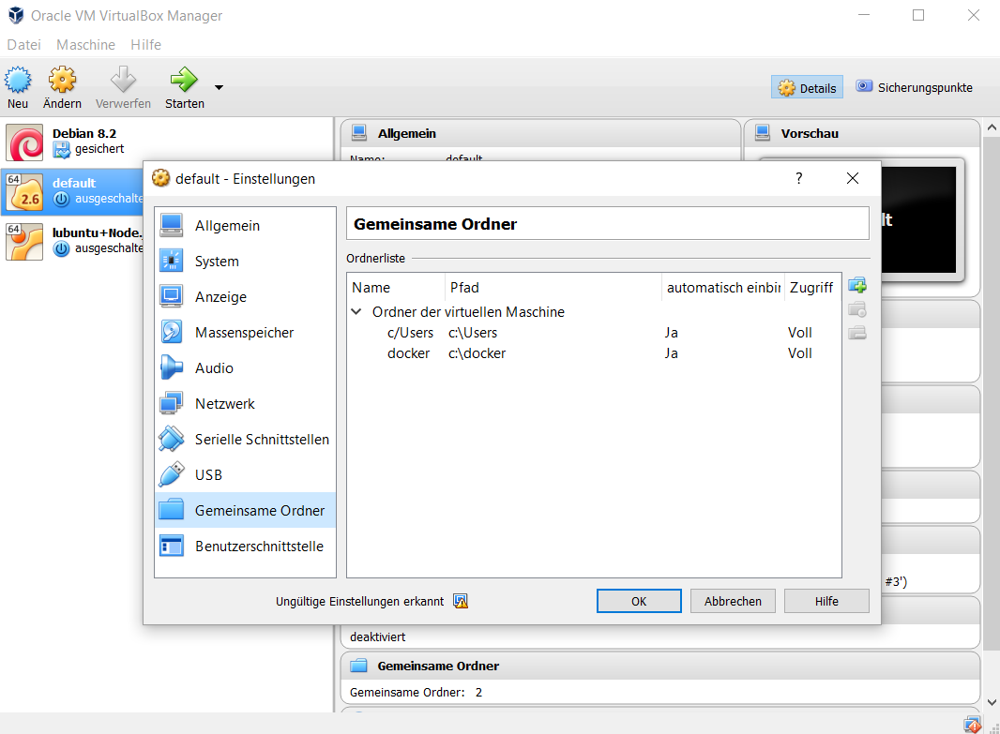

# ansible-aws-bash
A docker project to create a shall with all nessasary tools to automate AWS with ansible, maven and docker.

The idea is to create a environment which can be reproduced ans shared, but will not influence your own environment. 
By mounting custom information into the docker you can use your own project, ssh key and config inside the container. 

##Tools provides by the BASH
 
The follwoing tool will be provices by this shell

 * AWS-CLI
 * BOTO and BOTO3
 * Ansible 
 * Java
 * Maven
 * Docker-ce
 
 ## Hot to get it work
 
 You can start the bash of this container with the follwing command:
 
    docker run -ti -v $(pwd):/project -v ~/.aws:/root/.aws -v $HOME/.ssh:/root/.ssh  -v /var/run/docker.sock:/var/run/docker.sock kochp/ansible-aws-bash:v1.5 bash
    
 This command configures the follwing option: 
 
 * -v $(pwd):/project: Mount the current folder as Project folder into the container.
 * -v ~/.aws:/root/.aws: Mount your personal aws settings and credentials into the container.
 * -v $HOME/.ssh:/root/.ssh: Mount your personal ssh key into the container.
 * -v /var/run/docker.sock:/var/run/docker.sock: Mount the docker socket into the container to user docker in docker.

## Access dockerhost IP address

 If you want to access the dockerhost IP address from inside the docker container you can use the DNS-Name **_dockerhost_**. 
 This is useful for example to access other processes running on your local system. 
 
     ssh admin@dockerhost
     
 If you want to do that, make sure you are using the "host" network mode like this:
    
    docker run -ti --net="host"  -v $(pwd):/project -v ~/.aws:/root/.aws -v $HOME/.ssh:/root/.ssh  -v /var/run/docker.sock:/var/run/docker.sock kochp/ansible-aws-bash:v1.5 bash

## How to build and push

    docker login
    docker build -t kochp/ansible-aws-bash:v1.5 .
    docker push kochp/ansible-aws-bash:v1.5

## Dependencies

Depends on the image: williamyeh/ansible:ubuntu16.04

## Using docker bash with windows

In a windows environment the docker host run in a VirtualBox vm, directly mounting of folders will be not that easy. 
Follow the instruction to manage this problem:

* Determine the folder to share e.g. the project folder c:\docker
* Open VirtualBox and setup a shared folder für the used VM ("default") 

The shared folder with the name _docker_ and the path _c:\docker_ is now configured.

* startup this vm and connect to the console. Now mount in the linux of the dockerhost the shared folder with this command: 

    
    mkdir /docker
    sudo mount -t vboxsf docker /docker

* Modify the command above to start to the docker container with the path of the volumes mounted on the docker host:

    docker run -ti -v /docker/project:/project -v /docker/aws:/root/.aws -v /docker/ssh:/root/.ssh -v /var/run/docker.sock:/var/run/docker.sock kochp/ansible-aws-bash:v1.5 bash

 
 
